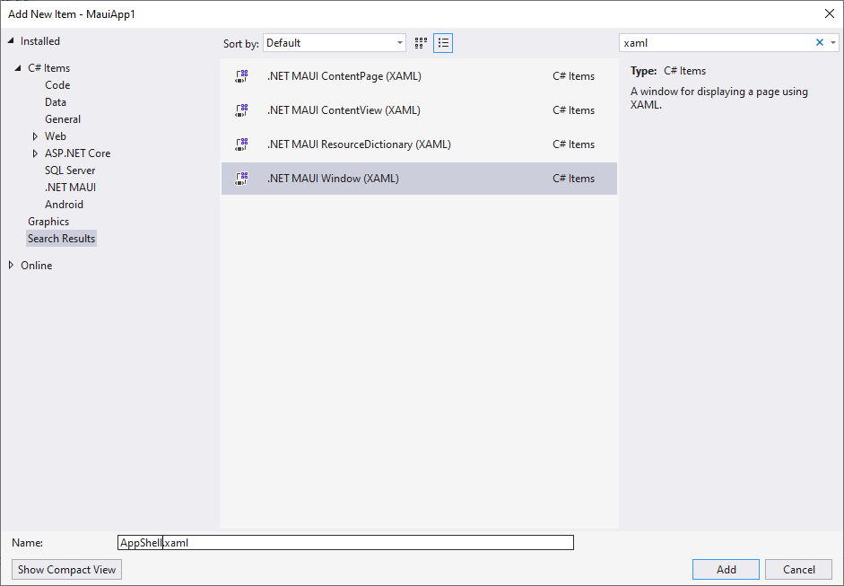

# Build your first iOS, Windows, & Android Apps with .NET MAUI & Visual Studio 
```
https://www.youtube.com/watch?v=WBF_ZmjdZ1I
```

`App.xaml.cs`

```cs
namespace MauiApp1
{
    public partial class App : Application
    {
        public App()
        {
            InitializeComponent();
        }

        protected override Window CreateWindow(IActivationState? activationState)
        {
            //return new Window(new MainPage()) { Title = "MauiApp1" };
            return new Window(new AppShell());
        }
    }
}
```

`AppShell.xaml`
```xaml
<?xml version="1.0" encoding="utf-8" ?>
<Window xmlns="http://schemas.microsoft.com/dotnet/2021/maui"
             xmlns:x="http://schemas.microsoft.com/winfx/2009/xaml"
             x:Class="MauiApp1.AppShell"
             Title="AppShell">

    <ShellContent 
        Title="Home"
        ContentTemplate="{DataTemplate local:MainPage}"
        Route="MainPage"/>
</Window>
```

