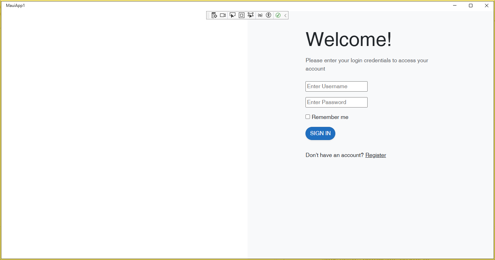

```
Components\Layout\EmptyLayout.razor
```

```
@inherits LayoutComponentBase

<div class="empty-layout">
    @Body
</div>
```

```
Components\Pages\Login.razor
```


```
@page "/login"
@layout EmptyLayout
@inject NavigationManager NavigationManager

<div class="container-fluid">
	<div class="row vh-100">

		<div class="col-md-6 d-none d-md-flex bg-image"></div>
		
		<div class="col-md-6 bg-light">
			<div class="login d-flex align-items-center py-5">
				<div class="container">
					<div class="row">
						<div class="col-lg-10 col-xl-7 mx-auto">
							<h3 class="display-4 mb-3">Welcome!</h3>
							<p class="text-muted mb-4">Please enter your login credentials to access your account</p>

							@if(!string.IsNullOrWhiteSpace(errorMessage))
							{
								<div class="alert alert-danger d-flex align-items-center mb-4" role="alert">
									<i class="bi bi-exclamation-triangle-fill flex-shrink-0 me-2"></i>
									<div>
										@errorMessage
									</div>
								</div>
							}

							<EditForm Model="model" FormName="LoginForm" OnValidSubmit="OnSubmit">
								
								<div class="form-group mb-3">
									<InputText @bind-Value="model.UserName" type="text" placeholder="Enter Username"/>
								</div>

								<div class="form-group mb-3">
									<InputText @bind-Value="model.Password" type="text" placeholder="Enter Password" />
								</div>

								<div class="custom-control custom-checkbox mb-3">
									<InputCheckbox id="remeberInput" @bind-Value="model.RememberMe" class="custom-checkbox" />
									<label class="custom-control-label" for="remeberInput">Remember me</label>
								</div>

								<button type="submit" class="btn btn-primary btn-block text-uppercase mb-2 rounded-pill shadow-sm">Sign in</button>

								<div class="text-center d-flex justify-content-between mt-4">
									<p>Don't have an account? <a href="/register" class="font-italic text-muted" /><u>Register</u></p>
								</div>
							</EditForm>
						</div>
					</div>
				</div>
			</div>
		</div>

	</div>

</div>

@code {
	[SupplyParameterFromForm]
	private LoginModel model { get; set; } = new ();

	private string errorMessage { get; set; }

	private async Task OnSubmit()
	{
		if (model.UserName == "admin")
		{
			errorMessage = string.Empty;
			await Task.Delay(1000);
			NavigationManager.NavigateTo("/");
		}
		else
		{
			errorMessage = "Invalid username. Please try again.";
		}
	}

	private class LoginModel
	{
		public string? UserName { get; set; }
		public string? Password { get; set; }
		public bool RememberMe { get; set; }
	}

}
```


