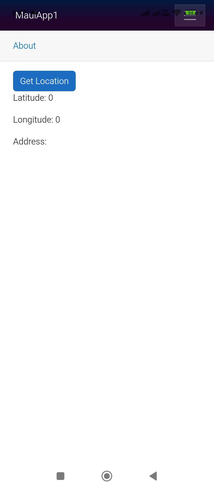
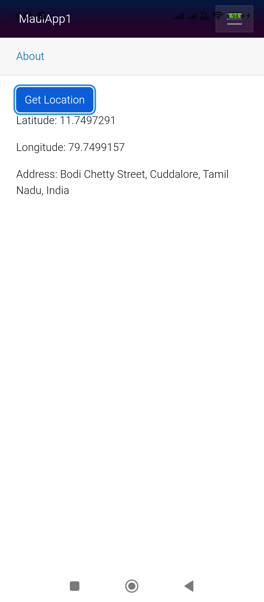

Your Blazor MAUI page has a few issues:

1. `using Microsoft.Maui.Devices.Sensors;` should be inside `@using`.
2. Check if `location` is null before accessing `location.Latitude`.
3. `placemarks` should only be fetched after confirming `location != null`.
4. Add a variable to display the address.
5. Call `StateHasChanged()` after updating values.

### Fixed Code

```razor
@page "/location"
@using Microsoft.Maui.Devices.Sensors
@using Microsoft.Maui.ApplicationModel

<button class="btn btn-primary" @onclick="GetLocation">
    Get Location
</button>

<p>Latitude: @Latitude</p>
<p>Longitude: @Longitude</p>
<p>Address: @Address</p>

@code {
    private double Latitude;
    private double Longitude;
    private string Address = "";

    private async Task GetLocation()
    {
        try
        {
            var status = await Permissions.RequestAsync<Permissions.LocationWhenInUse>();

            if (status != PermissionStatus.Granted)
            {
                Address = "Location permission denied.";
                return;
            }

            var request = new GeolocationRequest(
                GeolocationAccuracy.Medium,
                TimeSpan.FromSeconds(10));

            var location = await Geolocation.Default.GetLocationAsync(request);

            if (location == null)
            {
                Address = "Unable to get location.";
                return;
            }

            Latitude = location.Latitude;
            Longitude = location.Longitude;

            var placemarks = await Geocoding.Default.GetPlacemarksAsync(
                Latitude,
                Longitude);

            var place = placemarks?.FirstOrDefault();

            if (place != null)
            {
                Address =
                    $"{place.Thoroughfare}, " +
                    $"{place.Locality}, " +
                    $"{place.AdminArea}, " +
                    $"{place.CountryName}";
            }

            StateHasChanged();
        }
        catch (Exception ex)
        {
            Address = ex.Message;
        }
    }
}
```

### Android Permissions

In `Platforms/Android/AndroidManifest.xml` add:

```xml
<uses-permission android:name="android.permission.ACCESS_COARSE_LOCATION" />
<uses-permission android:name="android.permission.ACCESS_FINE_LOCATION" />
```

### iOS Permissions

In `Platforms/iOS/Info.plist` add:

```xml
<key>NSLocationWhenInUseUsageDescription</key>
<string>This app needs location access to show your current location.</string>
```

If you're using a .NET MAUI Blazor Hybrid app, this page will work on Android, iOS, Windows, and Mac (subject to platform location permissions).


